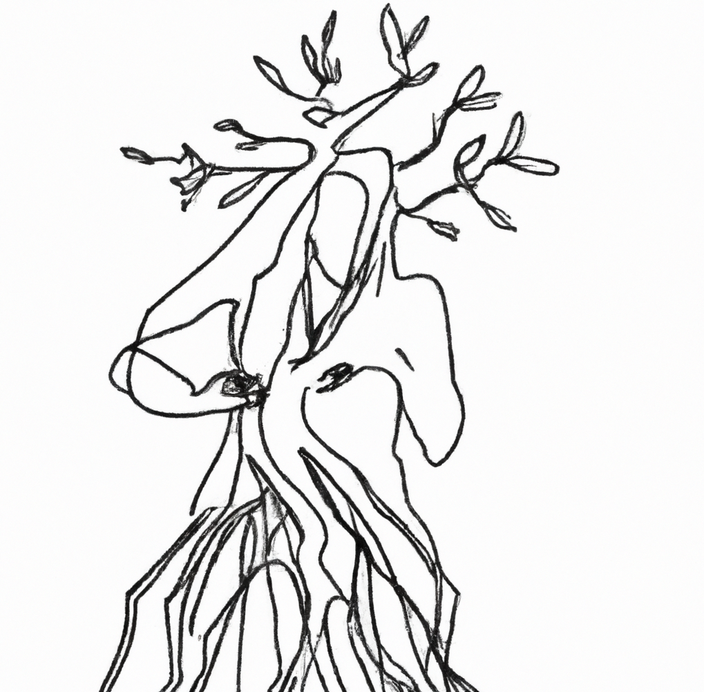

# FIONA: FInding Outliers iN Attributes

FIONA, short for "Finding Outliers in Attributes," is an innovative framework designed for the detection of categorical outliers within datasets. This configuration-free and user-friendly tool specializes in identifying unusual patterns in data attributes, making it invaluable for data analysis and decision-making processes. FIONA's key strengths lie in its ability to capture syntactic structures, its deterministic nature, and its adaptability to various encodings and languages, making it a powerful and accessible tool for outlier detection in diverse datasets.

FIONA is the Master's Thesis of Thanos Tsiamis
at Utrecht University for the program of Computing Science. It was developed under
the supervision of Dr. A.A.A. (Hakim) Qahtan for the academic year of 2022 - 2023.

## How to run
There are 2 ways to run the project: (i) [Locally](#local-execution) and (ii) in [Docker](#docker).

**We strongly advise towards the second way (Docker) due to its simplicity.**

### Local execution
**Important Note**: Make sure that node.Js and Python are installed in your system.

For the **front end**:

One-liner in terminal: `cd .\client_side\ & npm install & npm run dev`

Explanation:

- Open a terminal and cd to the `client_side` folder 
- Run the command `npm install`
- Run the command `npm run dev`

For the **back end**:

One-liner in terminal `cd api & pip install -r requirements.txt & python main.py`

Explanation:
- Open a second terminal and cd to the api folder
- Install the necessary requirements in `requirements.txt` file
- Run the command `python main.py`

### Docker
**Important Note**: A docker installation is required for it to work. More info on how to
install it [here](https://docs.docker.com/get-docker/).

Run the command:
`docker compose up`

## How to use
After the system is up and running, head to [http://localhost:3000](http://localhost:3000) and upload the file you want
outliers to be detected in the corresponding form.

Note: Back-end resides at [http://localhost:5000](http://localhost:5000).

## Note
Development was done on Windows 10 with Firefox and Chrome.

## Contact
We're always looking to improve our project, so any input you have is greatly appreciated. If you encounter any issues
or bugs, please report them on our GitHub issues page.
